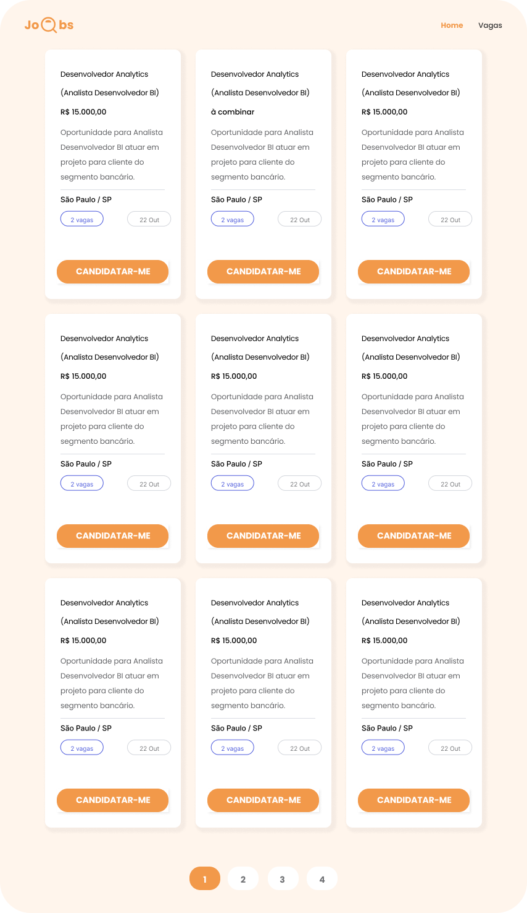

# Hackaton_GrupoA1

# ✨ Objetivo:

- **Desafio:** Web Scrapping + Processamento de Texto
- **Funcionalidades:** API Java Scrapping
- **Alvo:** Vagas (unorderned - endpoint: `https://www.vagas.com.br/vagas-de-'VALUE'`)
- **Assuntos:** Web Crawler, Java Web Scraping, Java Parse HTML

<b>📒 Regras de Negócio</b>

## Requisitos:
### 1. Vaga
    - String cargo (not null)
    - String empresa (not null)
    - String nivelVaga (not null)
    - Integer quantidadeVaga (null)
    - String detalheVaga (not null)
    - String localidade (not null)
    - Date dataPublicacao (now)
    - String salario (text ou à combinar)

### 2. Páginas (Front)
    - Página Produto: `domain.com`
    - Página Produto: `domain.com/vagas`

### Tecnologias e Libs
    - Angular
    - Java
    - JSoup: `https://jsoup.org/`

### Design
    - Página Inicial

    - Página Vagas

